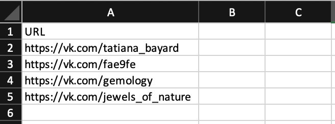

# Agencys page profiler

Project created for obtain the followers of different groups and pages in VK, also gets the medium views of the last 10 post published.

- You can try it using the `input.example.xlsx` file

## How it works
- We add our input file inside of the folder with the name `input.xlsx` (you can change it in the .env)
- We add our output file name in the `.env` by default will be `output.xlsx` and it will be inside of the folder `out`
- Install the dependencies: `bun install`
- For execute the script we use bun: `bun run start`
- It will ask you for the sheet where your info is located
- After you select the sheet will ask you for the column
- Your links will start to be proccesed and the errors will be save inside of `out/errors.out`

## Screen Captures

### Input

## Output

